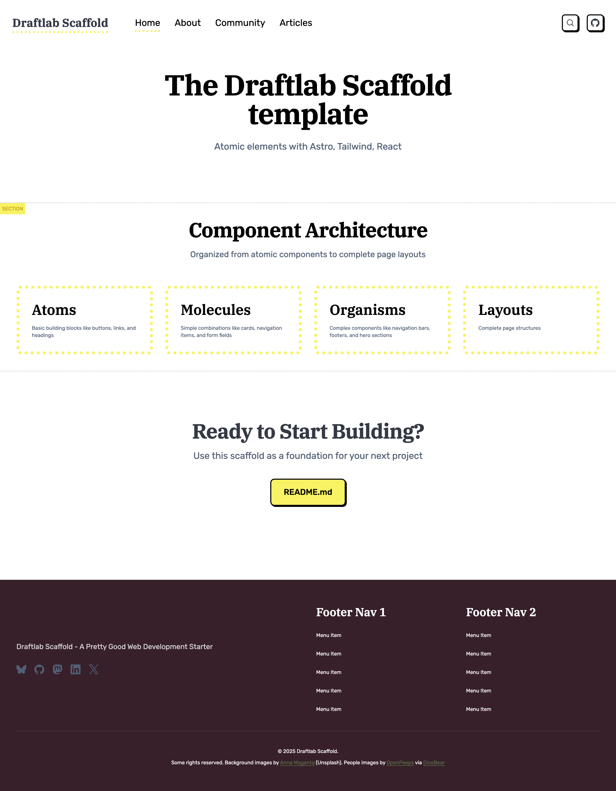
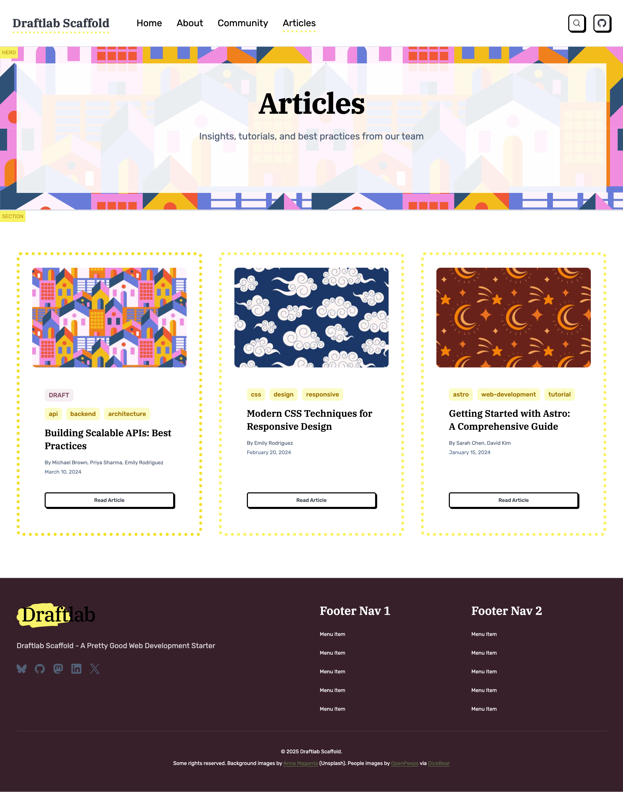
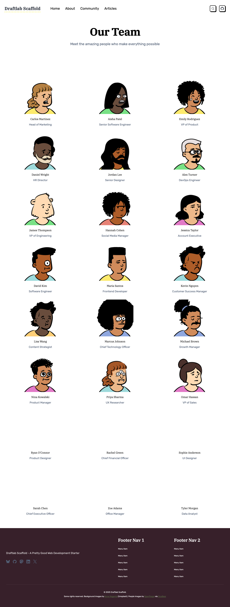

# Draftlab Scaffold

A modern, content-focused web template built with Astro v5, Tailwind CSS v4, and React v19. This scaffold provides a flexible page-building system with reusable components, type-safe content collections, and an integrated headless CMS.

[](https://app.netlify.com/projects/draftlab-scaffold/deploys)

## Installation

Create a new project using this template:

```sh
npx create-astro --template draftlab-org/scaffold
cd your-project-name
npm install
npm run dev
```

Or clone and install manually:

```sh
git clone https://github.com/draftlab-org/scaffold.git
cd scaffold
npm install
npm run dev
```

## Stack

The template combines Astro v5 for static site generation with Tailwind CSS v4 for styling and React v19 for interactive components. Content is managed through Astro's type-safe content collections with Pages CMS providing a visual editing interface. The build includes automatic image optimization and is preconfigured for Netlify deployment.

## Screenshots

### Homepage
The homepage showcases the component architecture with a clean hero section and visual representation of atomic design principles.



### Articles
The articles page displays blog posts in a card grid layout with hero images, tags, author information, and publication dates.



### People Directory
The people page features team members in a responsive grid with avatars, names, and titles.



### Rich Search
The rich search module provides fuzzy search across all content types with keyboard shortcuts and category filters.


## Architecture

### Component System

We are following atomic design principles described by Brad Frost (https://atomicdesign.bradfrost.com/chapter-2/) to make it easier to manage our components:


Components are organized from simple to complex in `src/components/`. Atoms like Button and Image are basic building blocks. Molecules combine atoms into simple patterns like Card. Organisms such as Hero and Navigation are complex, standalone components. Sections are full-width page blocks that combine organisms and molecules into complete interface sections.

### Development Utilities

The `DevOnly` component and `devClass` utility help manage development-only UI elements. Wrap any content in `<DevOnly>` to remove it from production builds. Use `devClass('classes')` to apply Tailwind classes only in development.

```astro
import DevOnly from '@components/atoms/DevOnly.astro'; import {devClass} from '@utils/dev';

<DevOnly><span>Debug info</span></DevOnly>
<div class={`base ${devClass('border-2 border-red-500')}`}></div>
```

### Content Collections

Content lives in `src/content/` with schemas defined in `config.ts`. The scaffold includes five core collections:

**Site Configuration** (`src/content/site/config.json`) - Global site settings including title, description, default SEO images, social media links, and favicon. This serves as the single source of truth for site-wide metadata and is fully editable through Pages CMS.

**Pages** (`src/content/pages/`) - YAML files where each file becomes a route. Pages contain a sections array that you can populate with any combination of Hero, RichText, Card, People, or Partners sections.

**Navigation** (`src/content/navigation/`) - JSON files defining menu structures. Includes main navigation and footer menus. Add new menus by creating additional JSON files.

**People** (`src/content/people/`) - Team member information as individual JSON files with headshots, titles, and department tags.

**Articles** (`src/content/articles/`) - Markdown blog posts with frontmatter including permalink, authors, tags, publish status, and hero images.

Images use absolute paths from the project root (`/src/assets/...`) for consistency. The image() helper in content collections automatically resolves and optimizes these at build time.

### Page Building

The dynamic route at `src/pages/[...slug].astro` renders pages from the Pages collection. Each page is assembled from sections in the order they appear in the YAML file. To create a new page, add a YAML file to `src/content/pages/` and the route appears automatically.

Section types are defined as a discriminated union in the content schema. Each section has its own structure and corresponding component in `src/components/sections/`. Hero sections display prominent titles, Rich text sections render markdown, Card sections show grids with optional images and buttons, People sections display team members, and Partners sections showcase logos with links.

### API Endpoints

Dynamic API endpoints automatically expose all content collections as JSON:

- `/api/pages.json` - All page data
- `/api/people.json` - All team members
- `/api/articles.json` - All articles with metadata and content
- `/api/navigation.json` - All navigation menus

The endpoint implementation at `src/pages/api/[collection].json.ts` automatically generates these routes from your content collections. Add a new collection to `config.ts` and it becomes available as an API endpoint with no additional configuration.

### Navigation & SEO

Navigation menus are managed through the Navigation collection and automatically populate the header and footer. The PageLayout component fetches menu data at build time, so changes to navigation files immediately reflect across all pages.

SEO defaults are defined in the Site Configuration collection. The Head component uses these as fallbacks when pages don't specify their own metadata. This includes default Open Graph images, site description, favicon, and social media links.

## Content Management

### Pages CMS

The template includes a complete configuration for Pages CMS in `.pages.yml`. This provides a visual interface for editing content without code.

Access the CMS by logging into https://app.pagescms.org with your Github profile (the project repository must be hosted on Github).

**Available in Pages CMS:**

- **Site Settings** - Global configuration, SEO defaults, and social links
- **Pages** - Page builder with drag-and-drop sections
- **Navigation Menus** - Header and footer menu management
- **Articles** - Blog post editor with markdown support
- **People** - Team member profiles

The interface lets you add, edit, and reorder page sections with a drag-and-drop builder. All components include validation and helpful descriptions.

### Automatic Permalink Synchronization

The repository includes GitHub Actions automation that keeps page filenames and permalinks synchronized. When changes are pushed or submitted via pull request:

- **Renaming a page file** automatically updates its `permalink` field to match the new filename
- **Changing a `permalink` field** automatically renames the file to match the new permalink value

This bidirectional sync runs via `.github/workflows/auto-fix-permalinks.yml` using the Python script at `.github/scripts/auto_fix_permalinks.py`. The automation commits any changes back to the repository, ensuring filenames and permalinks always stay in sync without manual intervention.

### Extending

To add new section types, update the schema in `src/content/config.ts`, create a component in `src/components/sections/`, and add the configuration to `.pages.yml`. The dynamic page route supports new sections automatically.

## Commands

```sh
npm run dev          # Development server
npm run build        # Production build
npm run preview      # Preview production build
```

## Project Structure

```
src/
├── assets/          # Images and media
├── components/
│   ├── atoms/       # Basic elements (Button, Image, Link, DevOnly)
│   ├── molecules/   # Simple combinations (Card, NavItem)
│   ├── organisms/   # Complex components (Hero, Person, Footer, Head)
│   └── sections/    # Page sections (HeroSection, CardSection, etc.)
├── content/
│   ├── articles/    # Blog posts (Markdown)
│   ├── navigation/  # Menu definitions (JSON)
│   ├── pages/       # Page definitions (YAML)
│   ├── people/      # Team members (JSON)
│   ├── site/        # Global configuration (JSON)
│   └── config.ts    # Content schemas with Zod validation
├── layouts/
│   ├── BaseLayout.astro   # Document wrapper
│   └── PageLayout.astro   # Page structure with header/footer
├── lib/
│   └── config.ts          # Site configuration helper
├── pages/
│   ├── api/
│   │   └── [collection].json.ts  # Dynamic API endpoints
│   ├── articles/
│   │   ├── index.astro    # Articles list
│   │   └── [id].astro     # Individual articles
│   ├── people/
│   │   ├── index.astro    # People directory
│   │   └── [id].astro     # Individual profiles
│   ├── [...slug].astro    # Dynamic page renderer
│   └── index.astro
├── utils/
│   └── dev.ts             # Development utilities
└── styles/
    ├── global.css         # Base imports
    ├── typography.css     # Text utilities
    ├── colors.css         # Color definitions
    └── breakpoints.css    # Responsive breakpoints
```

## Icons

The scaffold uses [unplugin-icons](https://github.com/unplugin/unplugin-icons) with [@iconify/json](https://github.com/iconify/icon-sets) for access to thousands of icons. Icons work in both Astro and React/TSX components.

### Usage in React/TSX Components

```tsx
import IconGithub from '~icons/simple-icons/github';
import MagnifyingGlassIcon from '~icons/heroicons/magnifying-glass-20-solid';

export default function MyComponent() {
  return (
    <div>
      <IconGithub class="w-6 h-6" />
      <MagnifyingGlassIcon class="w-5 h-5 text-gray-500" />
    </div>
  );
}
```

**Note:** Icons use `class` (not `className`) in both Astro and React components.

### Usage in Astro Components

```astro
---
import IconGithub from '~icons/simple-icons/github';
import MagnifyingGlassIcon from '~icons/heroicons/magnifying-glass-20-solid';
---

<div>
  <IconGithub class="w-6 h-6" />
  <MagnifyingGlassIcon class="w-5 h-5 text-gray-500" />
</div>
```

### Finding Icons

Browse available icons at [Icônes](https://icones.js.org/) or [Iconify](https://icon-sets.iconify.design/).

**Popular icon sets:**
- **Heroicons**: `~icons/heroicons/[icon-name]`
- **Simple Icons** (brands): `~icons/simple-icons/[brand-name]`
- **Material Design Icons**: `~icons/mdi/[icon-name]`
- **Lucide**: `~icons/lucide/[icon-name]`
- **Tabler Icons**: `~icons/tabler/[icon-name]`

Import pattern: `~icons/[collection]/[icon-name]`

Icons inherit text color and can be styled with Tailwind classes or standard CSS.

## Customization

Tailwind CSS v4 uses @theme definitions in the style files. Update `src/styles/colors.css` for color schemes and `src/styles/typography.css` for text sizing. Components follow atomic design hierarchy, so start with atoms and compose upward when building new features.

BaseLayout handles document-level concerns while PageLayout adds header, footer, and content structure. Create specialized layouts by extending these base layouts.

## Learn More

- [Astro Documentation](https://docs.astro.build)
- [Tailwind CSS v4 Docs](https://tailwindcss.com)
- [Pages CMS Docs](https://pagescms.org/docs)
- [Atomic Design Principles](https://atomicdesign.bradfrost.com/chapter-2/)
