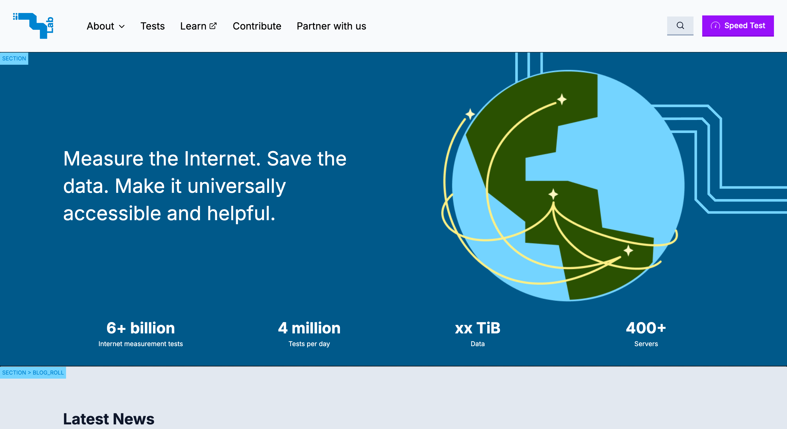
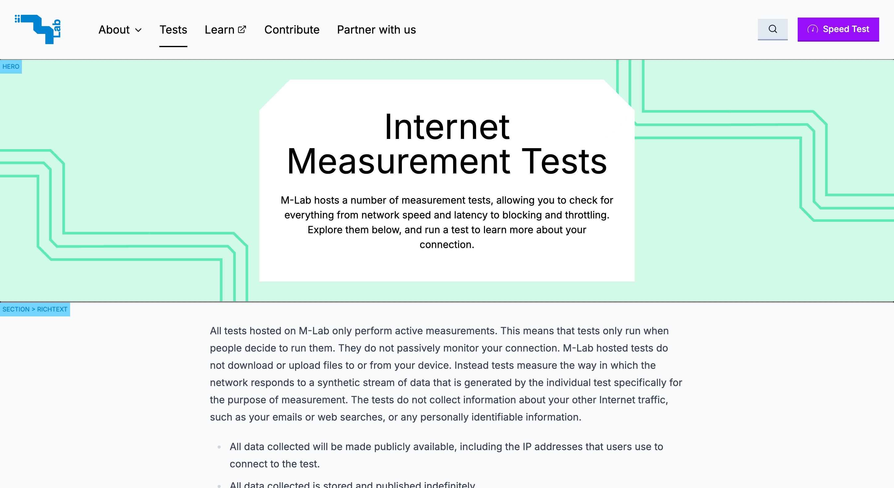
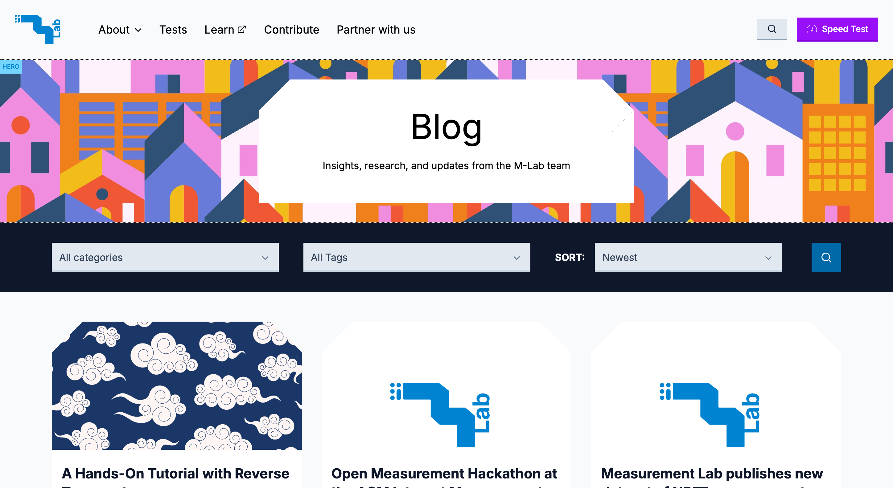

# Measurement Lab Website


[](https://app.netlify.com/projects/mlab-dev/deploys)

The official website for [Measurement Lab](https://measurementlab.net), an open-source project providing Internet performance measurement tools and data.

## Screenshots







## Quick Start

```bash
npm install
npm run dev      # Development server at localhost:4321
npm run build    # Production build
npm run preview  # Preview production build

PUBLIC_PREVIEW=true npm run dev      # Dev server with draft content visible
npm run sync:pages-categories        # Regenerate CMS category dropdowns
```

## Tech Stack

- **Astro 5** - Static site generation
- **Tailwind CSS 4** - Utility-first styling
- **React 19** - Interactive components
- **Pages CMS** - Git-based content management

## Project Structure

```
src/
├── assets/          # Images, logos, icons
├── components/
│   ├── atoms/       # Basic elements (Button, Link, Tag, Text, Heading)
│   ├── molecules/   # Compound components (Card, FormField, NavItem)
│   ├── organisms/   # Complex components (Navigation, Footer, Hero, Search)
│   ├── sections/    # Page section templates
│   └── landing/     # Custom landing page components (blog, publications)
├── content/         # All CMS-managed content (see below)
├── layouts/         # Page layout templates
├── lib/             # Shared libraries and utilities
├── pages/           # Route definitions
├── styles/          # Tailwind CSS configuration
└── utils/           # Helper functions
```

## Content Collections

All content lives in `src/content/` with type-safe schemas defined in `src/content/config.ts`.

| Collection      | Format   | Purpose                                                       |
| --------------- | -------- | ------------------------------------------------------------- |
| `pages/`        | YAML     | Static pages (about, contact, policies, etc.)                 |
| `blog/`         | Markdown | Blog posts with frontmatter                                   |
| `publications/` | JSON     | Research publications, papers, presentations                  |
| `people/`       | JSON     | Team member profiles                                          |
| `partners/`     | JSON     | Partner organizations                                         |
| `tests/`        | Markdown | M-Lab test documentation (supports nested sub-tests)          |
| `datasets/`     | JSON     | Dataset catalog with access points and coverage metadata      |
| `navigation/`   | JSON     | Menu structure (main.json, footer-1.json, footer-2.json)      |
| `site/`         | JSON     | Global site configuration (config.json, \_redirects.json)     |
| `homepage/`     | YAML     | Homepage-specific content                                     |
| `categories/`   | JSON     | Category definitions (see [Categories](#categories))          |

### Content Status

Every content collection above shares a `status` field: `draft`, `published`, or `archived`. **New content defaults to `draft`.**

| Status      | Production      | Preview / local dev |
| ----------- | --------------- | ------------------- |
| `published` | Visible         | Visible             |
| `archived`  | Visible, with an "archived" banner | Same |
| `draft`     | Hidden          | Visible             |

Visibility is centralised in `isVisible()` (`src/utils/content.ts`) — use it rather than checking `status` directly. Run the preview build locally with `PUBLIC_PREVIEW=true npm run dev`.

The `tests/` collection additionally has `testStatus` (`current`, `retired`, `core-service`, `retired-core-service`) for operational state — that is separate from `status`, which controls visibility.

## Page Sections

Pages use a flexible section-based system. Each page YAML file contains a `sections` array where you compose the page from available section types.

### Available Section Types

| Type                | Component               | Purpose                                          |
| ------------------- | ----------------------- | ------------------------------------------------ |
| `hero`              | HeroSection             | Page title with optional zigzag background       |
| `richText`          | RichTextSection         | Markdown content with optional table of contents |
| `button`            | ButtonSection           | Call-to-action buttons                           |
| `card`              | CardSection             | Card grid layouts                                |
| `people`            | PeopleSection           | Team member listings (filtered by category)      |
| `partners`          | PartnersSection         | Partner organization display                     |
| `blog_roll`         | BlogRollSection         | Latest blog posts (configurable limit)           |
| `related_posts`     | RelatedPostsSection     | Up to 3 hand-picked blog posts, same card layout |
| `tests`             | TestsSection            | Hand-picked tests, same card as the /tests page  |
| `speed_test`        | SpeedTestSection        | M-Lab speed test widget                          |
| `featured_partners` | FeaturedPartnersSection | Partner spotlight                                |
| `infrastructureMap` | InfrastructureMapSection | Mapbox infrastructure map (used on /status)     |
| `flexi`             | FlexiSection            | Nested section container                         |

A live example of every section type is rendered at `/section-showcase`.

### Section Backgrounds

All sections support a `background` property:

```yaml
background:
  color: white # Options: white, gray, primary-light, primary-medium, primary-dark
  image: /src/assets/my-image.jpg # Optional background image
```

### Zigzag Decorations

Hero sections support zigzag decorative backgrounds:

```yaml
zigzag:
  primary-light # Options: primary-light, primary-dark, secondary-light,
  # secondary-dark, supporting1-light, supporting1-dark,
  # supporting2-light, supporting2-dark
```

## Navigation Structure

Navigation is defined in JSON files in `src/content/navigation/`:

- **main.json** - Primary site navigation
- **footer-1.json** - First footer column
- **footer-2.json** - Second footer column

Navigation items can be:

- **Single links** - Direct link to a page or external URL
- **Dropdowns** - Menu with multiple links

Links can reference internal pages by `pageRef` (using the page's permalink) or external URLs.

## Categories

Categories control filtering and grouping. Each file in `src/content/categories/` is the **single source of truth** for one set of values:

| File                | Used For             | Count | Example Values                                              |
| ------------------- | -------------------- | ----- | ----------------------------------------------------------- |
| `blog.json`         | Blog post categories | 85    | Announcement, Data, NDT, Privacy, Research, Visualization    |
| `people.json`       | Team member sections | 5     | Maintainers, Experiment Review Committee, Advisory Committee, M-Lab Founders, Alumni |
| `partners.json`     | Partner groupings    | 4     | Supporting Research Projects, Supporting Partners, OMG Partners, BYOS Partners |
| `publications.json` | Publication types    | 4     | paper, regulatory-filing, presentation, documentation        |
| `tests.json`        | Test groupings       | 1     | Current Tests                                                |

Each file looks like this:

```json
{
  "id": "partners",
  "name": "Partner Categories",
  "categories": ["Supporting Research Projects", "Supporting Partners"]
}
```

### How categories reach the code and the CMS

Each list feeds **two** places, and both must agree or content breaks:

1. **Build-time validation.** `src/content/config.ts` imports these files directly and turns them into Zod enums, so a typo in a content file fails the build.
2. **Pages CMS dropdowns.** These populate the Category/Sections dropdowns in the CMS.

Pages CMS `select` fields only support a hardcoded local `values:` list — there is no option to fetch them from an API. So the dropdown values are **generated into `.pages.yml`** between marker comments:

```yaml
# pages-cms:category-sync start partners
values:
  - Supporting Research Projects
  - Supporting Partners
# pages-cms:category-sync end
```

`scripts/sync-pages-categories.mjs` rewrites everything between those markers from the matching `src/content/categories/<id>.json`. **Never edit the values between markers by hand** — they get overwritten.

```bash
npm run sync:pages-categories        # regenerate the dropdowns in .pages.yml
npm run sync:pages-categories:check  # verify they are in sync, without writing
```

The `.github/workflows/sync-pages-categories.yml` action runs the sync automatically on any push that touches `src/content/categories/`, and commits the updated `.pages.yml`. This matters because editors changing categories through Pages CMS commit JSON directly and never run anything locally.

### Adding a new category value

1. Add the value to the relevant `src/content/categories/*.json`
2. Run `npm run sync:pages-categories` (or let the GitHub Action do it)
3. Commit both the JSON file and the updated `.pages.yml`

To wire up a **new** category-backed dropdown, add the marker pair around an empty `values:` key in the field's `options:` block in `.pages.yml`, then run the sync. The script exits non-zero on an unknown category id, a missing end marker, or unexpected content between markers — it will not overwrite anything it did not generate.

## Deployment

- **Hosting:** Netlify
- **Auto-deploy:** Pushes to `main` branch trigger automatic deployment
- **Redirects:** Configured in `src/content/site/_redirects.json`

## Content Management

**Pages CMS is the recommended way to edit content.** It provides a visual interface that makes editing easier and reduces the chance of syntax errors. However, all content can also be edited directly in the repository files.

> **For content editors:** See the comprehensive **[CMS Editing Guide](docs/cms-guide.md)** for step-by-step instructions on using Pages CMS, including screenshots and a field reference for every content type.

### Using Pages CMS (Recommended)

1. Go to [app.pagescms.org](https://app.pagescms.org)
2. Log in with your GitHub account
3. Select the Measurement Lab repository
4. Edit content through the visual interface
5. Changes are committed directly to Git

CMS configuration is defined in `.pages.yml` at the project root.

### Direct File Editing

You can also edit content files directly in the repository. This is useful for:

- Bulk changes
- Complex edits not supported by the CMS
- Working offline

---

## Content Editing Reference

This section provides templates and examples for directly editing content files.

### Blog Posts

Create a new `.md` file in `src/content/blog/`:

```markdown
---
permalink: my-new-post
title: My New Blog Post
excerpt: A brief description of the post
authors:
  - chris-ritzo
status: published
categories:
  - Announcement
publishedDate: 2025-01-15
---

Your markdown content here...
```

**Required fields:**

- `permalink` - URL slug (no leading slash)
- `title` - Post title
- `categories` - Array of values from `src/content/categories/blog.json`
- `publishedDate` - Date in YYYY-MM-DD format

**Optional fields:**

- `status` - `draft`, `published`, or `archived` (defaults to `draft`, so set this to publish)
- `excerpt` - Short description for previews
- `authors` - Array of people IDs from `src/content/people/`
- `externalAuthors` - Comma-separated names for non-M-Lab authors
- `heroImage` - Path to hero image
- `relatedPosts` - Array of up to 3 blog post permalinks

### Pages

Create a new `.yaml` file in `src/content/pages/`:

```yaml
title: My New Page
permalink: my-page
sections:
  - type: hero
    title: Page Title
    zigzag: primary-light
    background:
      color: primary-medium

  - type: richText
    background:
      color: white
    withTOC: true
    content: |
      # Main Heading

      Your markdown content here...

      ## Subheading

      More content...

  - type: people
    category: Maintainers
    background:
      color: gray

  - type: blog_roll
    title: Latest News
    limit: 3
    showMore: true
```

### Team Members (People)

Create a new `.json` file in `src/content/people/`:

```json
{
  "id": "jane-smith",
  "name": "Jane Smith",
  "headshot": "/src/assets/people/jane-smith.jpg",
  "title": "Research Director",
  "affiliation": "Measurement Lab",
  "sections": ["Maintainers"],
  "status": "published"
}
```

**Required fields:**

- `id` - Unique identifier (should match filename without extension)
- `name` - Display name
- `headshot` - Path to headshot image
- `sections` - Array of values from `src/content/categories/people.json`

**Optional fields:**

- `status` - `draft`, `published`, or `archived` (defaults to `draft`)
- `title` - Job title
- `affiliation` - Organization name
- `extraInfo` - Additional info
- `url` - Personal/professional URL

### Partners

Create a new `.json` file in `src/content/partners/`:

```json
{
  "id": "example-partner",
  "name": "Example Partner",
  "url": "https://example.com",
  "category": "Supporting Partners",
  "image": "/src/assets/partners/example.png",
  "order": 10,
  "status": "published"
}
```

**Required fields:**

- `id` - Unique identifier
- `name` - Organization name
- `category` - One value from `src/content/categories/partners.json`

**Optional fields:**

- `status` - `draft`, `published`, or `archived` (defaults to `draft`)
- `url` - Partner website
- `image` - Path to logo image
- `affiliation` - Additional affiliation info
- `order` - Sort order (lower numbers appear first, default 999)

### Publications

Create a new `.json` file in `src/content/publications/`:

```json
{
  "id": "2025-example-paper",
  "title": "Example Research Paper",
  "description": "Brief description of the publication",
  "authors": "Smith, J., Johnson, A., Williams, B.",
  "contributors": ["jane-smith"],
  "year": 2025,
  "category": "paper",
  "venue": "ACM SIGCOMM",
  "publishedDate": "2025-03-15",
  "externalLinks": [
    {
      "label": "PDF",
      "url": "https://example.com/paper.pdf"
    }
  ],
  "tags": ["research", "measurement"]
}
```

**Required fields:**

- `id` - Unique identifier
- `title` - Publication title
- `year` - Publication year
- `category` - One value from `src/content/categories/publications.json`

**Optional fields:**

- `status` - `draft`, `published`, or `archived` (defaults to `draft`)
- `description` - Brief summary (supports markdown)
- `authors` - Citation string for all authors
- `contributors` - Array of people IDs from `src/content/people/` (for M-Lab team members)
- `venue` - Conference/journal name
- `publishedDate` - Full date
- `internalLinks` - Array of `{label, path}` for internal site links
- `externalLinks` - Array of `{label, url}` for external links
- `videoLinks` - Array of `{label, url, platform}` for video content
- `tags` - Array of tag strings

### Tests

Create a new `.md` file in `src/content/tests/`:

```markdown
---
permalink: /tests/my-test/
title: 'My Test'
description: 'Brief description of the test'
testStatus: current
status: published
icon: /src/assets/images/tests/my-test.png
order: 10
showInIndex: true
---

# My Test

Full markdown documentation for the test...
```

Tests can be nested: a test with sub-tests becomes a folder containing `index.md` (for example `src/content/tests/ndt/index.md`), with each sub-test alongside it and pointing at the parent via `parentTest`.

**Required fields:**

- `permalink` - URL path (should start with `/tests/`)
- `title` - Test name

**Optional fields:**

- `description` - Brief description
- `testStatus` - Operational status: current, retired, core-service, retired-core-service
- `status` - Visibility: `draft`, `published`, or `archived` (default: `draft`)
- `icon` - Path to icon image for tests index
- `order` - Sort order (default 999)
- `showInIndex` - Whether to show on tests index page (default true)
- `parentTest` - Parent test permalink for nested tests

### Navigation

Edit `src/content/navigation/main.json`:

```json
{
  "slug": "main",
  "title": "Main Navigation",
  "items": [
    {
      "type": "single",
      "link": {
        "type": "internal",
        "label": "About",
        "pageRef": "about"
      }
    },
    {
      "type": "dropdown",
      "label": "Resources",
      "links": [
        {
          "type": "internal",
          "label": "Publications",
          "pageRef": "publications",
          "description": "Research papers and presentations"
        },
        {
          "type": "external",
          "label": "GitHub",
          "externalUrl": "https://github.com/m-lab"
        }
      ]
    }
  ]
}
```

### Site Configuration

Edit `src/content/site/config.json`:

```json
{
  "title": "Measurement Lab",
  "description": "Site description for SEO",
  "url": "https://measurementlab.net",
  "favicon": "/favicon.svg",
  "defaultOgImage": "/src/assets/og-image.png",
  "defaultLogoLight": "/src/assets/logo-light.svg",
  "defaultLogoDark": "/src/assets/logo-dark.svg",
  "social": {
    "github": "https://github.com/m-lab",
    "x": "https://x.com/measurementlab",
    "linkedin": "https://www.linkedin.com/company/measurementlab"
  },
  "footer": {
    "description": "Footer description text (supports markdown links)",
    "bottom": "Copyright and license text (supports markdown links)"
  }
}
```

---

## Development Notes

> **Keep `src/content/config.ts` and `.pages.yml` in sync.** The Zod schema and the Pages CMS config describe the same content from two directions. If they drift, the CMS writes content the build then rejects.

### Adding New Content Types

1. Define the schema in `src/content/config.ts` and register it in `collections`
2. Create the collection folder in `src/content/`
3. Add category definitions in `src/content/categories/` if needed, then run `npm run sync:pages-categories`
4. Update Pages CMS config in `.pages.yml` for visual editing

### Creating New Section Types

1. Add to the `sectionsSchema` discriminated union in `src/content/config.ts`
2. Create the component in `src/components/sections/`
3. Register it in the switch in `src/components/sections/Sections.astro`
4. Add a component definition and a `blocks:` entry in `.pages.yml`
5. Optionally add an example to `src/content/pages/section-showcase.yaml`

## Useful Links

- [Astro Documentation](https://docs.astro.build)
- [Tailwind CSS Documentation](https://tailwindcss.com/docs)
- [Pages CMS Documentation](https://pagescms.org/docs)
- [React Documentation](https://react.dev)
