# M-Lab CMS Editing Guide

> **Last updated:** August 2026 | **Pages CMS version:** 1.0.0

This guide covers managing content on the M-Lab website using Pages CMS.

---

## About Pages CMS

[Pages CMS](https://pagescms.org) is a free, open-source content management system designed for static websites. It provides a user-friendly web interface where you can create and edit content — text, images, settings — without writing code or using developer tools. You can think of it as a UI layer on top of the website's files that translates markdown/JSON/YAML into forms, text editors, and image uploaders. You work in a visual editor and Pages CMS handles the technical details behind the scenes.

### How does it work?

The M-Lab website is stored as a collection of files on GitHub. When you edit content through Pages CMS, here is what happens:

1. **You make changes** in the CMS editor (e.g., update a blog post title or upload a new image).
2. **You click Save.** Pages CMS writes your changes to the corresponding file in the repository.
3. **The site rebuilds automatically.** Within a few minutes, the live website picks up your changes and updates itself.

---

## 1. Getting Started

### 1.1 Logging In

1. Go to [app.pagescms.org](https://app.pagescms.org).
2. Sign in with your GitHub account or with your email. If you don't have an account, ask the team admin to set one up for you.
3. On the dashboard, find **measurementlab.net** under "Last visited" or search for it in the repository list.
4. Click **Open** to enter the CMS.

> **Tip:** Bookmark the direct link to the project so you can skip the dashboard next time.

### 1.2 The CMS Dashboard

Once inside the project, you will see a sidebar on the left with all the content areas you can manage.

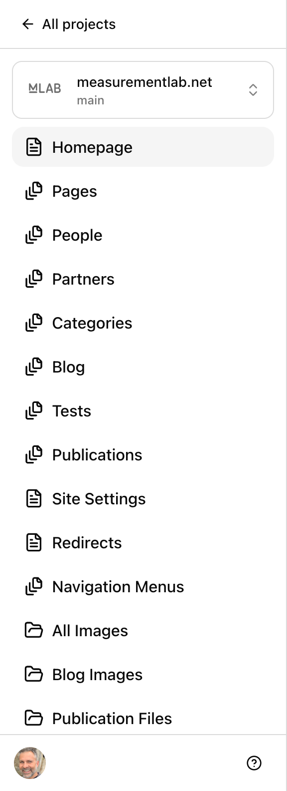

The sidebar is organized into three groups:

**Content (top section)**

- **Homepage** — The main landing page (single editor)
- **Pages** — All other site pages (list of entries)
- **Blog** — News and blog posts
- **People** — Team members and contributors
- **Partners** — Organizations and sponsors
- **Categories** — Tag groups used across the site
- **Tests** — M-Lab measurement tests and documentation
- **Publications** — Research papers and reports
- **Datasets** — The published data catalogue

**Site Administration (middle section)**

- **Site Settings** — Global site configuration (single editor)
- **Redirects** — URL redirect rules (single editor)
- **Navigation Menus** — Header and footer menus

**Media Libraries (bottom section)**

- **All Images** — Every image on the site
- **Blog Images** — Images used in blog posts
- **Publication Files** — PDFs and documents for publications

### 1.3 Understanding the Interface

The CMS uses three types of views:

**List view** — Shows all entries in a collection as a table. You can search, sort by column headers, and click any entry to edit it. Collections like Pages, Blog, People, Partners, and Publications all use this view.

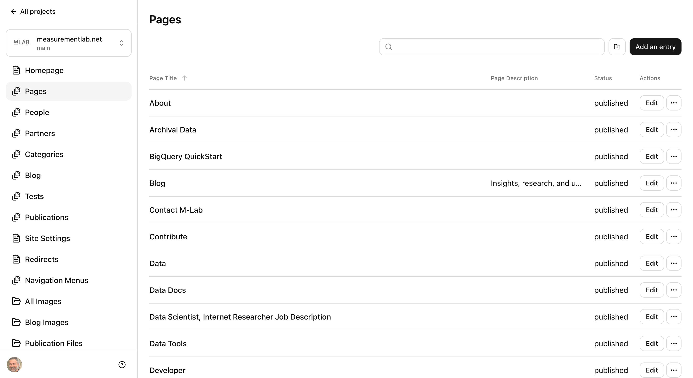

**Entry editor** — Opens when you click an entry from a list view. Shows all fields for that item with a **Save** button in the top-right corner. A change history panel on the right shows who last edited the file and when.

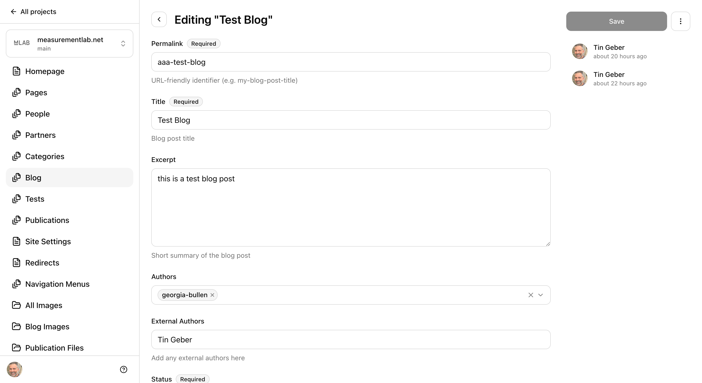

**Singleton editor** — Used for one-of-a-kind content like the Homepage, Site Settings, and Redirects. Works like the entry editor but without a list view — you go straight to the form.

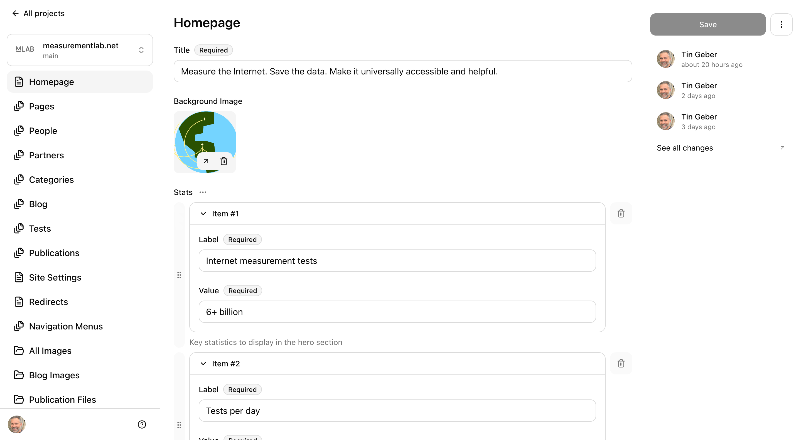

---

## 2. Key Concepts

### 2.1 Content Status: Draft, Published, Archived

Every piece of content has a **Status** field with three options:

| Status        | Meaning                | Where it appears                                       |
| ------------- | ---------------------- | ------------------------------------------------------ |
| **Draft**     | Work in progress       | Preview site only                                      |
| **Published** | Live and visible       | Live site and preview site                             |
| **Archived**  | Outdated but preserved | Live site and preview site, both with a warning banner |

When you create new content, it defaults to **Draft**. This means it will only be visible on the preview site, giving you a safe space to work without affecting the live website.

When you are ready to go live, change the status to **Published**.

If content becomes outdated but you want to keep it available, set it to **Archived**. Archived pages display a yellow banner at the top warning visitors that the information may be outdated.

> **Important:** Changing status to Published makes content visible on the live site immediately after saving. Double-check your work before publishing.

### 2.2 Saving Changes and Change History

After editing any content, click the **Save** button in the top-right corner. The button is grayed out until you make a change.

Every save creates a record in the change history panel on the right side of the editor. You can see who made each change and when. Clicking a change history entry takes you to the detailed record on GitHub.

### 2.3 The Rich Text Editor

Many fields use a rich text editor for formatted content. You can write using familiar formatting tools or use markdown syntax directly.

**Using the slash command menu:**

Type `/` on an empty line to open the command menu. This gives you quick access to:

- **Headings** (levels 1 through 6)
- **Bullet list** and **Ordered list**
- **Blockquote**
- **Code block**
- **Horizontal rule**
- **Image** (upload or select from the media library)
- **Table**

**Keyboard shortcuts:**

| Action | Shortcut                     |
| ------ | ---------------------------- |
| Bold   | `Ctrl+B` (or `Cmd+B` on Mac) |
| Italic | `Ctrl+I` (or `Cmd+I` on Mac) |
| Link   | `Ctrl+K` (or `Cmd+K` on Mac) |
| Undo   | `Ctrl+Z` (or `Cmd+Z` on Mac) |

**Adding links:**

1. Select the text you want to turn into a link.
2. Press `Ctrl+K` (or `Cmd+K` on Mac).
3. Paste or type the URL.
4. Press Enter to confirm.

For internal links, use a path starting with `/` (e.g., `/about-us`). For external links, use the full URL (e.g., `https://example.com`).

### 2.4 Images vs. Files: How They Are Handled Differently

The website treats **images** and **files** (like PDFs) differently:

**Images** (photos, logos, diagrams) are stored in `src/assets/` and processed by the site's build system. When you upload an image through the CMS, Astro automatically optimizes it for the web — resizing it, compressing it, and converting it to modern formats so pages load faster. This is why image fields in the CMS point to paths like `/src/assets/images/...`.

**Files** (PDFs, documents) are stored in the `public/` folder and served directly to visitors without any processing. Anything in the `public/` folder is accessible on the internet exactly as uploaded. The URL matches the folder structure:

| File location in repository     | URL on the website               |
| ------------------------------- | -------------------------------- |
| `public/publications/paper.pdf` | `yoursite.com/publications/paper.pdf` |
| `public/my-doc.pdf`             | `yoursite.com/my-doc.pdf`        |

This is why publication PDFs live in `public/publications/` — visitors can download them directly at a clean URL. Images, on the other hand, go through `src/assets/` so the site can optimize them for fast loading.

> **In short:** Use the **Image** field for photos and graphics (they get optimized). Use the **File** field for documents like PDFs (they are served as-is from the `public/` folder).

### 2.5 Working with Images

Image fields show an **Upload** button and a browse button (folder icon). You have two options:

1. **Upload** — Click the Upload button to select a file from your computer.
2. **Browse** — Click the folder icon to choose an existing image from the media library.

Once an image is attached, you will see a thumbnail preview. You can:

- Click the external link icon to view the full image
- Click the trash icon to remove it

> **Tip:** Use descriptive file names for images (e.g., `ndt-speed-test-diagram.png` instead of `screenshot-2024.png`). This helps with organization and accessibility.

### 2.6 Entering URLs in Buttons, Cards, and Links

When you type a URL into a component field (e.g., a button link or card link), make sure you format it correctly:

- **For pages on this site**, start with a forward slash: `/about-us`, `/tests/ndt`, `/blog`
- **For external websites**, write the full URL: `https://example.com`

If you forget the leading `/` on an internal link and just type `about-us`, the browser will try to append it to whatever page the visitor is currently on. For example, a visitor on `/tests` who clicks a link to `about-us` would end up at `/tests/about-us` instead of `/about-us` — which does not exist.

| What you type        | Where the visitor goes                   | Correct? |
| -------------------- | ---------------------------------------- | -------- |
| `/about-us`          | `yoursite.com/about-us`                  | Yes      |
| `about-us`           | depends on the current page — unreliable | No       |
| `https://example.com`| `example.com`                            | Yes      |

> **Rule of thumb:** Internal links always start with `/`. External links always start with `https://`.

---

## 3. Managing Content

### 3.1 People

**Where:** Sidebar > **People**

The People collection stores team members, contributors, and advisors.

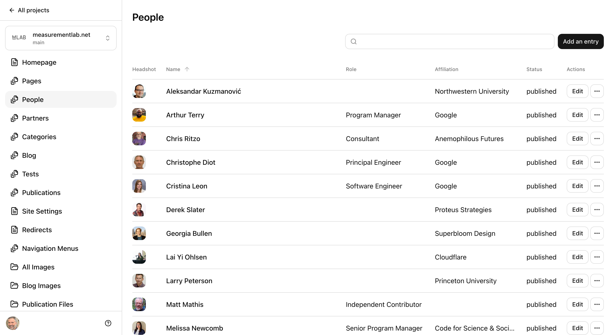

**Fields:**

| Field                           | Required | Description                                              |
| ------------------------------- | -------- | -------------------------------------------------------- |
| **ID**                          | Yes      | Unique identifier in slug format (e.g., `jane-doe`)      |
| **Name**                        | Yes      | Full display name                                        |
| **Status**                      | Yes      | Draft, Published, or Archived (defaults to Draft)        |
| **Headshot**                    | Yes      | Profile photo                                            |
| **Role**                        | No       | Job title or role (e.g., "Principal Investigator")       |
| **Affiliation**                 | No       | Organization name                                        |
| **Other/Previous Affiliations** | No       | Additional affiliation details                           |
| **Link**                        | No       | External URL (personal website, profile page)            |
| **Sections**                    | Yes      | Team groupings (e.g., "Maintainers", "Advisory Committee") |

**To add a new person:**

1. Click **Add an entry** in the top-right corner.
2. Fill in the **ID** field with a slug-format identifier (e.g., `jane-doe`). This cannot be changed later.
3. Fill in the **Name** and upload a **Headshot**.
4. Select one or more **Sections** to categorize this person.
5. Set the **Status** to Published when ready to go live.
6. Click **Save**.

> **Tip:** The Sections field controls where a person appears on the website. For example, selecting "Maintainers" will show them in the Maintainers group on the People page. The available options come from the People category group — see [Section 3.5](#35-categories).

### 3.2 Partners

**Where:** Sidebar > **Partners**

The Partners collection stores organizations that collaborate with M-Lab.

**Fields:**

| Field            | Required | Description                                      |
| ---------------- | -------- | ------------------------------------------------ |
| **ID**           | Yes      | Unique identifier (e.g., `google`)               |
| **Partner Name** | Yes      | Organization name                                |
| **Status**       | Yes      | Draft, Published, or Archived                    |
| **Affiliation**  | No       | Partnership level (e.g., "Platinum Sponsor")     |
| **Website URL**  | No       | Partner's website                                |
| **Categories**   | Yes      | One or more partner groupings (e.g., "Supporting Partners", "BYOS Partners"). Pick every group the partner belongs to. |
| **Logo**         | No       | Partner organization logo                        |

**To add a new partner:**

1. Click **Add an entry**.
2. Set the **ID** (e.g., `acme-corp`).
3. Enter the **Partner Name** and select one or more **Categories**.
4. Upload a **Logo** image.
5. Set **Status** to Published and click **Save**.

### 3.3 Blog Posts

**Where:** Sidebar > **Blog**

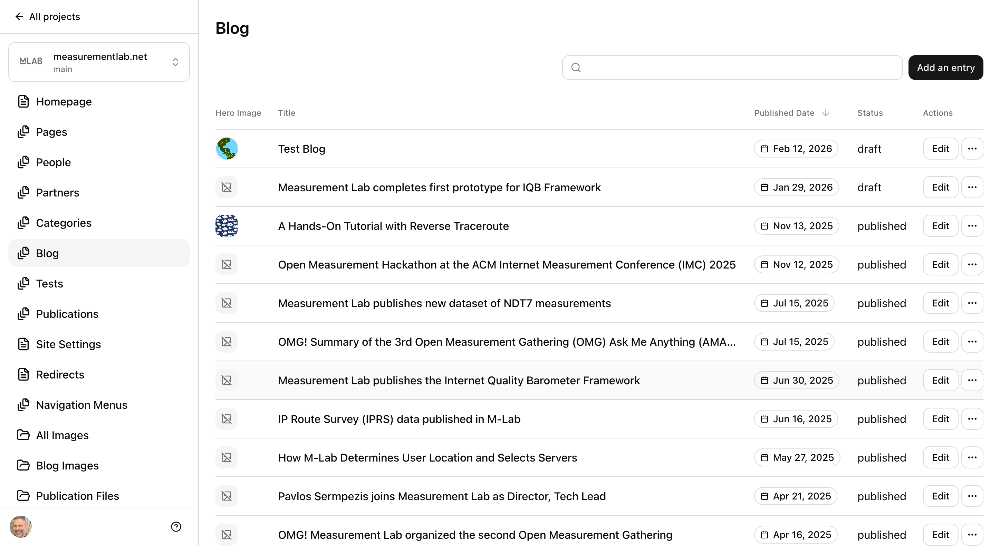

The blog list view shows posts sorted by date (newest first). You can search by title and sort by different columns.

**Fields:**

| Field                | Required | Description                                     |
| -------------------- | -------- | ----------------------------------------------- |
| **Permalink**        | Yes      | URL slug (e.g., `my-blog-post-title`)           |
| **Title**            | Yes      | Post headline                                   |
| **Excerpt**          | No       | Short summary for previews and cards            |
| **Authors**          | No       | Select from the People collection               |
| **External Authors** | No       | Names of authors not in the People collection   |
| **Status**           | Yes      | Draft, Published, or Archived                   |
| **Published Date**   | Yes      | Publication date (format: `YYYY-MM-DD`)         |
| **Hero Image**       | No       | Featured image displayed at the top of the post |
| **Related Posts**    | No       | Select up to 3 related blog posts               |
| **Categories**       | Yes      | One or more topic tags                          |
| **Body**             | No       | The main content of the post (rich text)        |

**To create a new blog post:**

1. Click **Add an entry**.
2. Set the **Permalink** — this becomes the URL. Use lowercase words separated by hyphens (e.g., `new-ndt-release-2024`).
3. Enter the **Title** and **Published Date**.
4. Select at least one **Category**.
5. Write the post content in the **Body** field using the rich text editor.
6. Optionally add a **Hero Image**, **Authors**, and **Related Posts**.
7. When ready, set **Status** to Published and click **Save**.

> **Tip:** Use the **Excerpt** field to control what appears on blog listing pages and social media previews. If left empty, the beginning of the body text is used instead.

### 3.4 Publications

**Where:** Sidebar > **Publications**

Publications are research papers, reports, and other academic works related to M-Lab.

**Fields:**

| Field                  | Required | Description                                       |
| ---------------------- | -------- | ------------------------------------------------- |
| **ID**                 | Yes      | Unique identifier (e.g., `2024-the-state-of-ndt`) |
| **Title**              | Yes      | Publication title                                 |
| **Status**             | Yes      | Draft, Published, or Archived                     |
| **Description**        | No       | Brief summary (supports rich text/markdown)       |
| **Authors**            | No       | Citation string (e.g., "Jane Doe, John Smith")    |
| **M-Lab Contributors** | No       | Link to people in the M-Lab team                  |
| **Year**               | Yes      | Publication year                                  |
| **Category**           | Yes      | Publication type                                  |
| **Internal Links**     | No       | Upload files (PDFs) to attach to the publication  |
| **External Links**     | No       | Links to external sources                         |
| **Video Links**        | No       | Links to related videos (YouTube, Vimeo, etc.)    |
| **Published Date**     | No       | Exact publication date                            |
| **Venue**              | No       | Conference, journal, or event name                |
| **Tags**               | No       | Keyword tags                                      |

**Adding file downloads:**

To attach a downloadable file (like a PDF):

1. Scroll to **Internal Links** and click **Add an item**.
2. Enter a **Label** (e.g., "Download PDF").
3. Click the **File** field to upload or select a file from the Publication Files media library.

**Adding external links:**

1. Scroll to **External Links** and click **Add an item**.
2. Enter a **Label** (e.g., "View on Google Scholar").
3. Enter the full **URL** (e.g., `https://scholar.google.com/...`).

### 3.5 Categories

**Where:** Sidebar > **Categories**

Categories are tag groups shared across the site. Different collections (Blog, People, Partners, Publications) each have their own set of categories.

**Fields:**

| Field          | Required | Description                                                                          |
| -------------- | -------- | ------------------------------------------------------------------------------------ |
| **ID**         | Yes      | Which collection this category group belongs to (e.g., `blog`, `people`, `partners`) |
| **Name**       | Yes      | Display name for the group                                                           |
| **Categories** | Yes      | List of category values                                                              |

**To add a new category to a group:**

1. Open the category group (e.g., "Blog Categories").
2. In the **Categories** list, click **Add an item**.
3. Type the new category name.
4. Click **Save**.
5. **Wait a couple of minutes**, then reload the CMS before trying to use the new value. See below.

> **Important: your new category will not appear in dropdowns right away.**
>
> The Category and Sections dropdowns you see elsewhere in the CMS — on Blog posts, People, Partners and Publications, and on the People Section and Partners Section blocks you add to a page — are not read live from this collection. They are copied into the site's CMS configuration file by an automated job that runs after you save.
>
> So the sequence is: you save a new category → an automated job updates the configuration → the new value becomes selectable. This usually takes **a couple of minutes**. If the new category is missing from a dropdown, wait a moment and reload the page.
>
> You do not need to do anything to trigger this — just don't be surprised by the delay.

> **Important:** Removing a category that is in use by existing content will break the site build, because existing entries would then reference a value that no longer exists. Check that no entries use a category before deleting it.

> **Note for developers:** The dropdown values live between marker comments in `.pages.yml` and are regenerated by `scripts/sync-pages-categories.mjs`, run automatically by a GitHub Action. Never edit those values by hand. See the [README](../README.md#categories) for details.

### 3.6 Pages (Block Editor)

**Where:** Sidebar > **Pages**

Pages are the most flexible content type. Each page is built from a series of **sections** (blocks) that you can add, remove, and reorder.

**Page-level fields:**

| Field                | Required | Description                                                                                                                                     |
| -------------------- | -------- | ----------------------------------------------------------------------------------------------------------------------------------------------- |
| **Page Title**       | Yes      | The title shown in the browser tab and hero section                                                                                             |
| **Permalink**        | Yes      | URL slug (e.g., `about-us` becomes `/about-us`). You can add slashes in the name, for example `jobs/data-scientist` or `tests/ndt/data/example` |
| **Status**           | Yes      | Draft, Published, or Archived                                                                                                                   |
| **Page Description** | No       | SEO meta description (shown in search results)                                                                                                  |
| **Hero Image**       | No       | Background image for the page hero area                                                                                                         |
| **Zigzag Pattern**   | No       | Decorative pattern (only shown when there is no hero image)                                                                                     |
| **Page Sections**    | No       | The main content blocks of the page                                                                                                             |

**Available section types:**

| Section Type                   | What it does                                                           |
| ------------------------------ | ---------------------------------------------------------------------- |
| **Hero Section**               | Large title and subtitle at the top of a page                          |
| **Rich Text Section**          | Free-form text with formatting, images, and optional table of contents |
| **Button Section**             | One or more call-to-action buttons with an optional title              |
| **Card Section**               | Grid of content cards with titles, descriptions, icons, and buttons    |
| **People Section**             | Displays team members filtered by department/section                   |
| **Partners Section**           | Displays partner logos filtered by category                            |
| **Flexi Section**              | A container that holds nested sections (Rich Text, Button, or Card)    |
| **Blog Roll Section**          | Shows the latest blog posts with configurable count                    |
| **Tests Section**              | Displays tests you pick yourself, as a grid of cards                   |
| **Infrastructure Map Section** | Interactive map of M-Lab server locations                              |

**To add a section to a page:**

1. Scroll to the **Page Sections** area.
2. Click **Add an item**.
3. A dropdown appears — select the section type you want.
4. Fill in the section fields.
5. Click **Save**.

**To reorder sections:**

Each section has a drag handle (six dots icon) on its left side. Click and drag to move sections up or down.

**To remove a section:**

Click the trash icon on the right side of the section header.

**Section backgrounds:**

Most sections include a **Section Background** setting with two options:

- **Color** — Choose from White, Gray, Light Blue, Medium Blue, Dark Blue, Light Purple, or Dark Purple. On the dark options (Medium Blue, Dark Blue, Dark Purple) the text, links and buttons switch to light automatically — you do not need to change anything else.
- **Type** — Full-width or Contained

**Working with Card Sections:**

Card sections are commonly used for feature highlights. Each card has:

- **Title** (required) — Card heading
- **Content** — Short description (rich text)
- **Image** — Card image (when set, the icon is not shown)
- **Color** — Color theme (Neutral, Primary/Blue, Secondary/Yellow, Supporting 1/Green, Supporting 2/Sap Green, Speed/Purple)
- **Icon** — Choose from Measurement, Insights, Community, M-Lab Blue, or M-Lab White
- **Button** — Optional call-to-action with variant (Primary/Secondary), size, text, and link URL

**Working with Rich Text Sections:**

- **Include Table of Contents** — Toggle this on to auto-generate a table of contents from your headings
- **Content** — Use the rich text editor for your content

### 3.7 Homepage

**Where:** Sidebar > **Homepage**

The Homepage is a singleton editor — there is only one, and you edit it directly.


**Homepage-specific fields:**

| Field                | Required | Description                                                                    |
| -------------------- | -------- | ------------------------------------------------------------------------------ |
| **Title**            | Yes      | The main headline displayed in the hero area                                   |
| **Background Image** | No       | Hero section background image                                                  |
| **Stats**            | No       | Key statistics shown in the hero (label + value pairs)                         |
| **Page Sections**    | Yes      | Content blocks (same as Pages, plus Speed Test and Featured Partners sections) |

The Homepage has two additional section types not available on regular pages:

- **Speed Test Section** — Embeds the NDT speed test widget
- **Featured Partners Section** — Displays a curated selection of partner logos

**To edit a stat:**

1. Find the **Stats** area and expand the item you want to edit.
2. Change the **Label** (e.g., "Internet measurement tests") and/or the **Value** (e.g., "6+ billion").
3. Click **Save**.

**To add a new stat:**

1. Click **Add an item** at the bottom of the Stats list.
2. Enter the **Label** and **Value**.
3. Click **Save**.

### 3.8 Tests

**Where:** Sidebar > **Tests**

The Tests collection documents all M-Lab measurement tests. It uses a **tree view** layout, meaning some tests have sub-pages (child entries) nested underneath them.

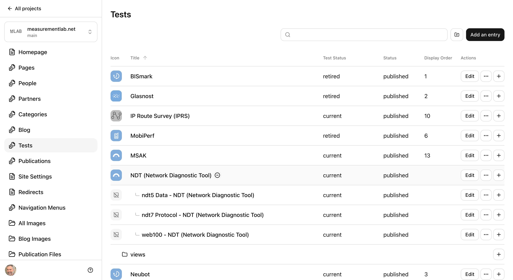

In the list view, parent tests show an expand button (arrow icon) next to their name. Click it to reveal child entries indented below.

**Fields:**

| Field             | Required | Description                                                                 |
| ----------------- | -------- | --------------------------------------------------------------------------- |
| **Slug**          | Yes      | URL identifier (e.g., `ndt`)                                                |
| **Permalink**     | Yes      | Full URL path (e.g., `/tests/ndt/`)                                         |
| **Title**         | Yes      | Display name of the test                                                    |
| **Description**   | No       | Brief summary of what the test measures                                     |
| **Test Status**   | No       | Operational status: Current, Core Service, Retired, or Retired Core Service |
| **Status**        | Yes      | Content visibility: Draft, Published, or Archived                           |
| **Icon**          | No       | Test icon image                                                             |
| **Display Order** | No       | Position in listings (lower numbers appear first)                           |
| **Content**       | No       | Full documentation (rich text)                                              |

> **Important:** Tests have two different status fields. **Test Status** describes whether the test is currently active on M-Lab's platform (Current, Retired, etc.). **Status** controls whether the test page is visible on the website (Draft, Published, Archived). Don't confuse these — a retired test should typically still be Published so its documentation remains accessible.

**To create a child test page:**

1. In the Tests list, find the parent test.
2. Click the **+** icon on the right side of the parent row.
3. Fill in the child test's fields.
4. Click **Save**.

### 3.9 Datasets

**Where:** Sidebar > **Datasets**

The Datasets collection is the catalogue of M-Lab's published data, shown at `/datasets`. Each entry describes one dataset: what it contains, how far back it goes, and where to get it.

**Fields:**

| Field                   | Required | Description                                                                |
| ----------------------- | -------- | -------------------------------------------------------------------------- |
| **ID**                  | Yes      | URL-safe identifier (e.g., `ndt`). Becomes the page path `/datasets/ndt/`  |
| **Dataset Name**        | Yes      | Display title                                                              |
| **Status**              | Yes      | Draft, Published, or Archived                                              |
| **Description**         | Yes      | Plain-text summary (also used for search engines)                          |
| **Data Category**       | No       | Raw (archival logs) or Enriched (parsed and queryable)                      |
| **Related Test**        | No       | The M-Lab test this data comes from                                        |
| **Related Datasets**    | No       | Other closely related datasets                                             |
| **Coverage Start Date** | No       | Earliest data available (e.g., `2009-01-01`)                               |
| **Coverage End Date**   | No       | Latest data, or `present` for ongoing collection                           |
| **Spatial Coverage**    | No       | Geographic scope (defaults to "Global")                                    |
| **Update Frequency**    | No       | Continuous, Daily, Weekly, Monthly, Irregular, or Static                   |
| **Approximate Size**    | No       | Human-readable size hint (e.g., "~500 GB/year")                            |
| **Access Points**       | No       | Where to get the data — see below                                          |
| **Documentation Links** | No       | Further reading, each with a Label and URL                                 |

**Adding an access point:**

Access Points are how someone actually reaches the data (a BigQuery table, a cloud storage bucket, a download link).

1. Scroll to **Access Points** and click **Add an item**.
2. Enter a **Label** (e.g., "BigQuery — ndt.unified_downloads").
3. Enter the **URL or Path**, the **Format** (e.g., `BigQuery table`, `JSONL`), and optionally a **Type** and **Description**.

**About the Keywords field:**

Keywords describe what a dataset is *about*. They are not shown on the page — they go into the machine-readable metadata that search engines and research-data catalogues read, which is how someone finds this dataset without already knowing it exists.

Enter only terms specific to this dataset, such as `TCP throughput`, `video streaming`, or `packet loss`. Four M-Lab base terms — Internet measurement, Network performance, Broadband, Open data — are added to every dataset automatically, so there is no need to repeat them (and no harm if you do; duplicates are removed).

Leaving Keywords empty is fine. The dataset still gets the four base terms — but it will then look identical to every other dataset to a search engine, so a few specific terms are worth adding.

---

## 4. Site Administration

### 4.1 Site Settings

**Where:** Sidebar > **Site Settings**

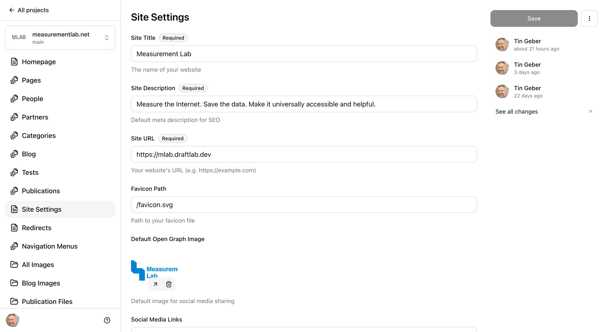

Site Settings control global configuration that affects every page on the website.

**Fields:**

| Field                        | Required | Description                                                                   |
| ---------------------------- | -------- | ----------------------------------------------------------------------------- |
| **Site Title**               | Yes      | The website name (appears in browser tabs and search results)                 |
| **Site Description**         | Yes      | Default meta description for SEO                                              |
| **Site URL**                 | Yes      | The website's base URL                                                        |
| **Favicon Path**             | No       | Path to the browser tab icon                                                  |
| **Default Open Graph Image** | No       | Default image for social media sharing                                        |
| **Social Media Links**       | No       | URLs for BlueSky, Mastodon, GitHub, LinkedIn, X, Facebook, Instagram, YouTube |
| **Archived Banner**          | No       | Message and color for the banner shown on archived pages                      |
| **Cookie Consent**           | No       | Cookie banner message and Google Analytics ID                                 |

**Common tasks:**

**Updating social media links:**

1. Open **Site Settings**.
2. Scroll to **Social Media Links**.
3. Enter the full URL for each platform (e.g., `https://github.com/m-lab`).
4. Leave a field empty to hide that platform's icon from the footer.
5. Click **Save**.

**Changing the archived page banner:**

1. Open **Site Settings**.
2. Scroll to **Archived Banner**.
3. Edit the **Message** text.
4. Choose a **Color** from the dropdown (Primary/Blue, Secondary/Yellow, Supporting 1/Green, Supporting 2/Sap Green, Neutral/Gray, Speed/Purple).
5. Click **Save**.

**Setting up Google Analytics:**

1. Open **Site Settings**.
2. Scroll to **Cookie Consent**.
3. Enter your GA4 Measurement ID in the **Google Analytics Measurement ID** field (e.g., `G-XXXXXXXXXX`).
4. Leave it empty to disable analytics.
5. Click **Save**.

### 4.2 Navigation Menus

**Where:** Sidebar > **Navigation Menus**

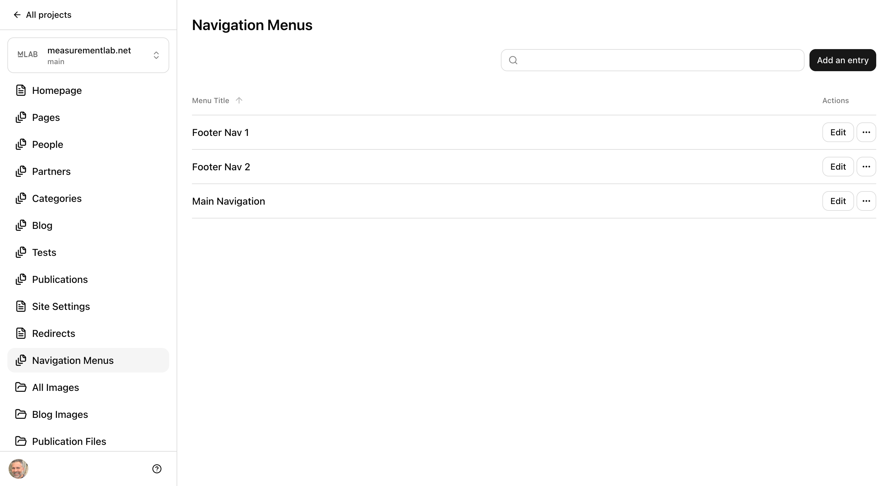

The site has three navigation menus:

| Menu                | Where it appears           |
| ------------------- | -------------------------- |
| **Main Navigation** | Top header bar             |
| **Footer Nav 1**    | Left column of the footer  |
| **Footer Nav 2**    | Right column of the footer |

Each menu contains **menu items**, which can be one of two types:

- **Single Link** — A direct link to a page or URL
- **Dropdown Menu** — A label that expands to show multiple links (header menu only)

**Each link can be:**

- **Internal Page Link** — Select a page from the Pages collection (the URL is generated automatically)
- **External Link** — Enter a full URL (e.g., `https://example.com`)

**To add a menu item:**

1. Open a navigation menu (e.g., "Main Navigation").
2. Scroll to **Menu Items** and click **Add an item**.
3. Choose **Single Link** or **Dropdown Menu**.
4. For a Single Link, configure the link as Internal or External.
5. For a Dropdown Menu, enter a label and add links to the dropdown.
6. Click **Save**.

**To reorder menu items:**

Drag items using the handle (six dots) on the left side.

### 4.3 Redirects

**Where:** Sidebar > **Redirects**

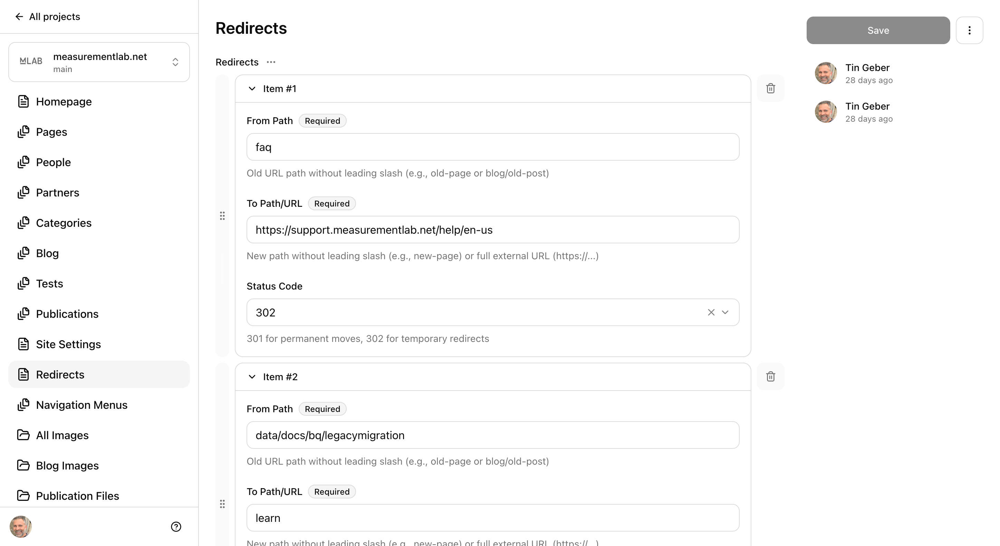

Redirects automatically send visitors from an old URL to a new one. Use them when you rename or move a page to avoid broken links.

**Each redirect has three fields:**

| Field           | Required | Description                                                               |
| --------------- | -------- | ------------------------------------------------------------------------- |
| **From Path**   | Yes      | The old URL path without a leading slash (e.g., `old-page`)               |
| **To Path/URL** | Yes      | The new path (e.g., `new-page`) or full URL (e.g., `https://example.com`) |
| **Status Code** | No       | `301` for permanent moves (default), `302` for temporary redirects        |

**To add a redirect:**

1. Open **Redirects**.
2. Click **Add an item** at the bottom of the list.
3. Enter the **From Path** (e.g., `tools/ndt`).
4. Enter the **To Path/URL** (e.g., `tests/ndt`).
5. Select the **Status Code** — use 301 unless the move is temporary.
6. Click **Save**.

> **Tip:** Use `301` (permanent) for pages that have been permanently moved or renamed. Use `302` (temporary) only if you plan to restore the original URL later.

---

## 5. Media Libraries

### 5.1 All Images

**Where:** Sidebar > **All Images**

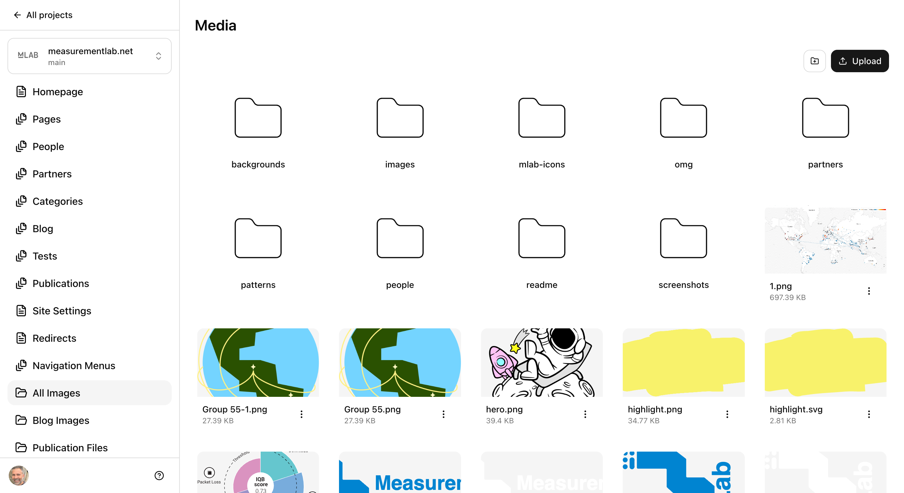

The All Images library shows every image used across the website. From here you can:

- **Browse** existing images
- **Upload** new images by clicking the upload button or dragging files in
- **Delete** images you no longer need

Images are organized in folders that match the site structure (e.g., `images/blog/`, `images/tests/`).

> **Important:** Before deleting an image, make sure it is not used by any content. Deleting an image that is still referenced will cause a broken image on the website.

### 5.2 Blog Images

**Where:** Sidebar > **Blog Images**

A filtered view showing only images in the blog images folder. When you upload a hero image or insert an image in a blog post body, it is stored here.

### 5.3 Publication Files

**Where:** Sidebar > **Publication Files**

This library stores downloadable files attached to publications (typically PDFs). Upload files here or directly from a publication entry's **Internal Links** field.

---

## 6. Quick Reference

### 6.1 Field Types at a Glance

| Field Type       | What You See                                  | Example                                          |
| ---------------- | --------------------------------------------- | ------------------------------------------------ |
| **Text**         | Single-line text input                        | Page Title, Name                                 |
| **Text Area**    | Multi-line plain text input                   | Excerpt, Description                             |
| **Rich Text**    | Formatted text editor with toolbar            | Blog Body, Section Content                       |
| **Select**       | Dropdown menu                                 | Status, Color, Category                          |
| **Multi-select** | Dropdown with checkboxes for multiple choices | Blog Categories, Sections                        |
| **Date**         | Date picker                                   | Published Date                                   |
| **Number**       | Numeric input with arrows                     | Year, Display Order                              |
| **Boolean**      | Toggle switch (on/off)                        | Show "More" Button, Include Table of Contents    |
| **Image**        | Upload/browse with preview                    | Hero Image, Headshot                             |
| **File**         | Upload/browse for documents                   | Publication files (PDFs)                         |
| **Reference**    | Select from another collection                | Authors (from People), Related Posts (from Blog) |
| **Block**        | Choose from multiple types                    | Page Sections, Navigation items                  |

### 6.2 Page Section Types

| Section                | Best for                                | Key fields                                                     |
| ---------------------- | --------------------------------------- | -------------------------------------------------------------- |
| **Hero**               | Page title with decorative background   | Title, Subtitle, Background Image, Zigzag Pattern              |
| **Rich Text**          | Long-form text content                  | Content, Table of Contents toggle, Background                  |
| **Button**             | Call-to-action links                    | Title, Buttons (variant, size, text, URL)                      |
| **Card**               | Feature grids, service highlights       | Title, Description, Cards (with icon/image/button), Background |
| **People**             | Team member displays                    | Category filter (dropdown), Background                         |
| **Partners**           | Partner logo grids                      | Title, Category filter (dropdown), Background                  |
| **Flexi**              | Complex layouts with nested sections    | Title, Description, Nested Sections                            |
| **Blog Roll**          | Latest news feed (automatic)            | Title, Description, Post count, "More" button toggle           |
| **Related Posts**      | Up to 3 blog posts you choose yourself  | Title, Description, Posts                                      |
| **Tests**              | Tests you choose yourself               | Title, Description, Tests, Background                          |
| **Infrastructure Map** | Server location visualization           | Title, Description                                             |
| **Speed Test**         | NDT test widget (Homepage only)         | Title, Description                                             |
| **Featured Partners**  | Curated partner display (Homepage only) | Title, Description                                             |

### 6.3 Status Cheatsheet

| I want to...                                          | Set Status to... |
| ----------------------------------------------------- | ---------------- |
| Work on something without it going live               | **Draft**        |
| Make content visible on the live website              | **Published**    |
| Keep old content accessible but mark it as outdated   | **Archived**     |
| Remove content from the live site without deleting it | **Draft**        |

### 6.4 Troubleshooting

**My changes aren't showing on the live site.**

- Check the **Status** field. Content set to Draft is only visible on the preview site.
- Make sure you clicked **Save**. The Save button is grayed out if no changes have been made.
- The live site may take a few minutes to rebuild after saving. Wait and refresh.

**I can't find the Save button.**

- The **Save** button is in the top-right corner of the editor. If it's grayed out, you haven't made any changes yet.

**I accidentally published something I shouldn't have.**

- Open the entry and change the **Status** back to **Draft**. Click **Save**. The content will be removed from the live site after the next rebuild.

**An image isn't showing up.**

- Make sure the image was uploaded successfully — you should see a thumbnail preview.
- Check that the image path hasn't been changed or the image deleted from the media library.

**I want to undo my changes.**

- If you haven't saved yet, simply reload the page to discard your changes.
- If you have already saved, the change history panel (right side of the editor) shows previous versions. Contact your admin if you need to restore an earlier version.

**The page URL is wrong.**

- The URL is determined by the **Permalink** field. Edit it to change the URL.
- If the old URL was already shared, add a redirect (see [Section 4.3](#43-redirects)) from the old path to the new one.

**I see "Required" on a field but can't figure out what to enter.**

- Required fields are marked with a **Required** badge. Hover over or check the help text below the field for guidance on what format is expected.

**I added a new category, but it isn't in the dropdown.**

- This is expected. New category values take a couple of minutes to become selectable, because an automated job has to copy them into the CMS configuration first. Wait a moment and reload the page. See [Section 3.5](#35-categories).
- If it still hasn't appeared after several minutes, check that you clicked **Save** on the category group, and ask a developer to check that the sync job ran.

**The section type I need isn't available.**

- Different page types have different available sections. The Homepage includes Speed Test and Featured Partners sections that regular Pages don't have. Regular Pages include a Hero section that the Homepage doesn't.

---

## 7. Advanced: Working Directly in GitHub

While Pages CMS is the recommended way to manage content, you can also edit files and upload assets directly through the GitHub website. This is useful for bulk operations, uploading many files at once, uploading big files, or making quick fixes when the CMS is slow or unavailable.

> **Important:** Direct GitHub editing bypasses the CMS's form validation. Be extra careful with file formats, field names, and required values. A typo in a YAML or JSON file can break the site build.

### 7.1 Accessing the Repository

1. Go to [github.com/m-lab/measurementlab.net](https://github.com/m-lab/measurementlab.net).
2. Make sure you are on the **main** branch (the default).
3. Navigate through the folder structure to find the file you want to edit.

### 7.2 Where Content Lives

Every piece of content in the CMS maps to a file in the repository. Here's where to find each type:

| Content Type     | Path                               | File Format                                           |
| ---------------- | ---------------------------------- | ----------------------------------------------------- |
| Homepage         | `src/content/homepage/index.yaml`  | YAML                                                  |
| Pages            | `src/content/pages/`               | YAML (e.g., `about.yaml`)                             |
| Blog Posts       | `src/content/blog/`                | Markdown with YAML frontmatter (e.g., `my-post.md`)   |
| People           | `src/content/people/`              | JSON (e.g., `jane-doe.json`)                          |
| Partners         | `src/content/partners/`            | JSON (e.g., `google.json`)                            |
| Publications     | `src/content/publications/`        | JSON (e.g., `2024-the-state-of-ndt.json`)             |
| Categories       | `src/content/categories/`          | JSON (e.g., `blog.json`)                              |
| Tests            | `src/content/tests/`               | Markdown with YAML frontmatter (e.g., `ndt/index.md`) |
| Datasets         | `src/content/datasets/`            | JSON (e.g., `ndt.json`)                               |
| Navigation Menus | `src/content/navigation/`          | JSON (e.g., `main.json`)                              |
| Site Settings    | `src/content/site/config.json`     | JSON                                                  |
| Redirects        | `src/content/site/_redirects.json` | JSON                                                  |

### 7.3 Where Media Files Live

| Media Library     | Repository Path           | Usage                                                      |
| ----------------- | ------------------------- | ---------------------------------------------------------- |
| All Images        | `src/assets/`             | General site images (people headshots, page images, icons) |
| Blog Images       | `src/assets/images/blog/` | Hero images and inline images for blog posts               |
| Publication Files | `public/publications/`    | PDFs and documents attached to publications                |

### 7.4 Editing a Content File on GitHub

1. Navigate to the file in the repository (e.g., `src/content/blog/my-post.md`).
2. Click the **pencil icon** (Edit this file) in the top-right corner of the file view.
3. Make your changes in the editor.
4. Scroll down to the **Commit changes** section.
5. Write a short description of what you changed (e.g., "Fix typo in blog post title").
6. Select **Commit directly to the `main` branch**.
7. Click **Commit changes**.

The site will automatically rebuild after each commit. This usually takes a few minutes.

> **Tip:** Use the **Preview** tab (for Markdown files) to check your formatting before committing.

### 7.5 Uploading Images and Files

**To upload images:**

1. Navigate to the appropriate folder:
   - People headshots: `src/assets/images/people/`
   - Blog images: `src/assets/images/blog/`
   - Test icons: `src/assets/images/tests/`
   - Partner logos: `src/assets/images/partners/`
   - Other images: `src/assets/images/`
2. Click **Add file** > **Upload files**.
3. Drag and drop your files or click **choose your files** to browse.
4. Write a commit message (e.g., "Add headshot for Jane Doe").
5. Click **Commit changes**.

**To upload publication files (PDFs):**

1. Navigate to `public/publications/`.
2. Click **Add file** > **Upload files**.
3. Upload your PDF files.
4. Commit the changes.

> **Tip:** When uploading many files at once, GitHub's drag-and-drop uploader is much faster than adding them one by one through the CMS.

### 7.6 Referencing Uploaded Images in Content

After uploading an image, you need to reference it correctly in your content files. The path format depends on where the image is used:

**In YAML/JSON content fields** (e.g., hero images, headshots, logos):

Use the full path from the repository root, starting with `/src/assets/`:

```
/src/assets/images/people/jane-doe.jpg
```

**In Markdown content** (blog post bodies, test documentation):

Use the same path format:

```markdown

```

**For publication files** (PDFs in `public/publications/`):

Use the path without `public/`:

```
publications/my-paper.pdf
```

### 7.7 Creating a New Content Entry via GitHub

If you prefer to create content files directly, here's the format for each type:

**Blog post** (`src/content/blog/my-new-post.md`):

```markdown
---
permalink: my-new-post
title: My New Blog Post
excerpt: A short summary of the post.
authors: []
externalAuthors: ''
status: draft
publishedDate: 2024-06-15
heroImage: /src/assets/images/blog/my-hero.png
relatedPosts: []
categories:
  - Research
---

Your blog post content goes here. Use **Markdown** formatting.
```

**Person** (`src/content/people/jane-doe.json`):

```json
{
  "id": "jane-doe",
  "name": "Jane Doe",
  "status": "draft",
  "headshot": "/src/assets/images/people/jane-doe.jpg",
  "title": "Principal Investigator",
  "affiliation": "University of Example",
  "extraInfo": "",
  "url": "https://example.com/jane",
  "sections": ["Maintainers"]
}
```

> The `sections` values must come from `src/content/categories/people.json`, and `category` values from `partners.json`. A value that isn't in those lists will break the site build.

**Partner** (`src/content/partners/acme-corp.json`):

```json
{
  "id": "acme-corp",
  "name": "Acme Corporation",
  "status": "draft",
  "affiliation": "Infrastructure Partner",
  "url": "https://acme.example.com",
  "category": ["Supporting Partners"],
  "image": "/src/assets/images/partners/acme-logo.png"
}
```

> **Important:** Always set `status` to `"draft"` when creating content directly. You can change it to `"published"` through the CMS after reviewing the result on the preview site.

### 7.8 Tips for Direct GitHub Editing

- **YAML is whitespace-sensitive.** Use spaces (not tabs) for indentation, and keep indentation consistent. A misplaced space can break the file.
- **JSON requires strict syntax.** Every string must be in double quotes, every object and array properly closed, and no trailing commas after the last item.
- **Test on the preview site first.** After committing changes, check the preview site before changing status to published.
- **Use the CMS for complex pages.** Pages with multiple sections and nested blocks are much easier to manage through the CMS's visual editor than by editing YAML by hand.
- **Commit messages matter.** Write clear descriptions of your changes. This helps other team members understand the change history and makes it easier to track down issues.
