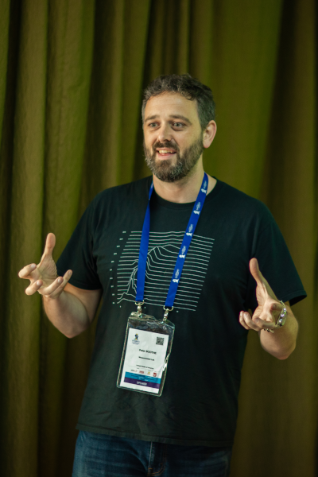

M-Lab was pleased to be invited to contribute to the Internet Measurements
workshop at the [2019 African Internet Summit][ais2019], June 15-16, 2019 in Kampala,
Uganda. M-Lab tech lead, Peter Boothe, and advisor, Georgia Bullen, presented a
hands-on tutorial on querying and visualizing performance and routing datasets.

[ais2019]: https://www.internetsociety.org/events/africa-internet-summit/2019/

The two-day workshop featured presentations and hands-on sessions from several
other Internet measurement initiatives and researchers, including M-Lab:

- Measuring Web Latency & Rendering performance - Alemnew Asrese,
  Aalto University School of Electrical Engineering

* Measuring Mobile Broadband - Ahmed Elmokashfi, NORNNet/Simulamet

- RIPE Atlas Tutorial & Hands-on Sessions presented by Jasper den Hertog and Gerardo Viviers
- Internet Disruption Measurements presented by Wairagala Wakabi from
  the Collaboration on International ICT Policy for East and Southern Africa
  (CIPESA)
- Internet shutdown in Benin - an Internet measurement perspective - Yazid Akanho
- State of the Internet Measurement in Africa - Musab Isah
- [Creating a “long-term memory” for the global DNS][dns-memory] - Willem Toorop
- [Measurement Lab Tutorial & Hands-on Session][mlab] - Georgia Bullen, Peter Boothe
- Preparation for the DNS Measurement hackathon - Willem Toorop

[dns-memory]: https://bit.ly/2IJlayR
[mlab]: https://bit.ly/mlab-ais2019

For M-Lab, the workshop was an opportunity to contribute support and training for
researchers interested in studying the Internet using a variety of datasets and
tools. In particular our team continued to explore collaborations with other
open source measurement intiatives like RIPE, and to meet researchers working
with both open platforms in tandem.

The M-Lab session introduced many participants to our platform and datasets,
many of whom were more familiar with RIPE Atlas. The workshop presented how
M-Lab measurements and platform differ from RIPE, explored what questions could
be answered with M-Lab data, and identified key areas of interest from
participants, such as:

- NDT performance measurements
- Working with ASN data
- Traceroute data
- Sidestream data
- Switch data

The tutorial covered various ways to access and use M-Lab data, including SQL
querying in BigQuery and visualizing data using DataStudio. Of particular note
was the interest in using M-Lab data to inform use of RIPE Atlas probes.

Our team was thankful for the opportunity to collaborate with researchers and
other measurement initiatives at AIS 2019, and are hopeful for future
collaborations to follow.
